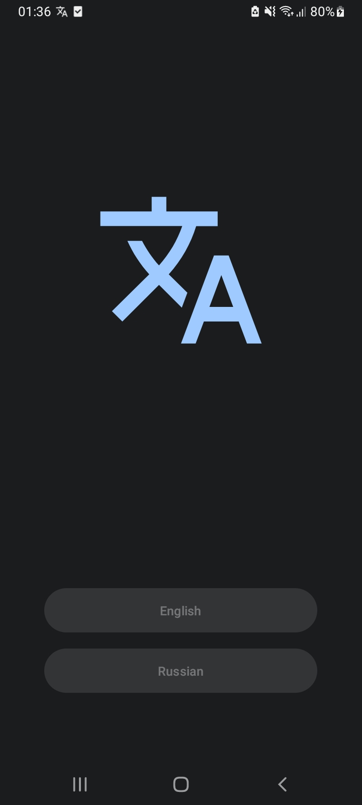
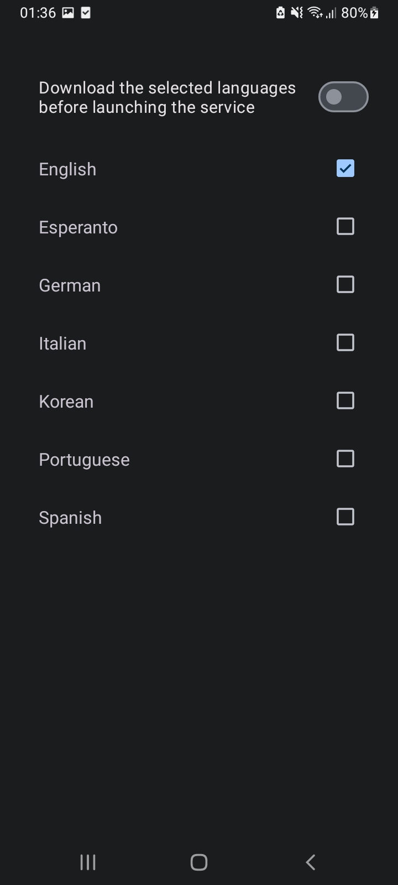
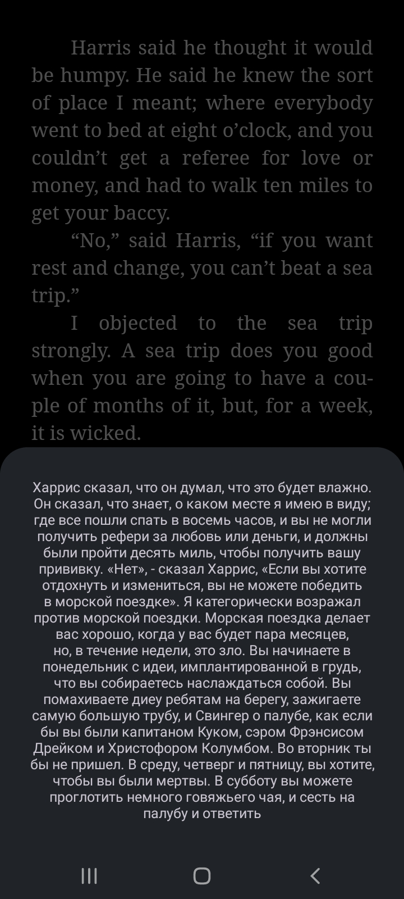

# ScreenTranslation
An application for translating text from the device screen
# Translate 
To translate the text, the application uses:
* Online mode - <a href="https://github.com/LibreTranslate/LibreTranslate">LibreTranslate</a>
* Offline mode - <a href="https://developers.google.com/ml-kit/language/translation/android">ML Kit </a>
# Screenshots

  
  
  

